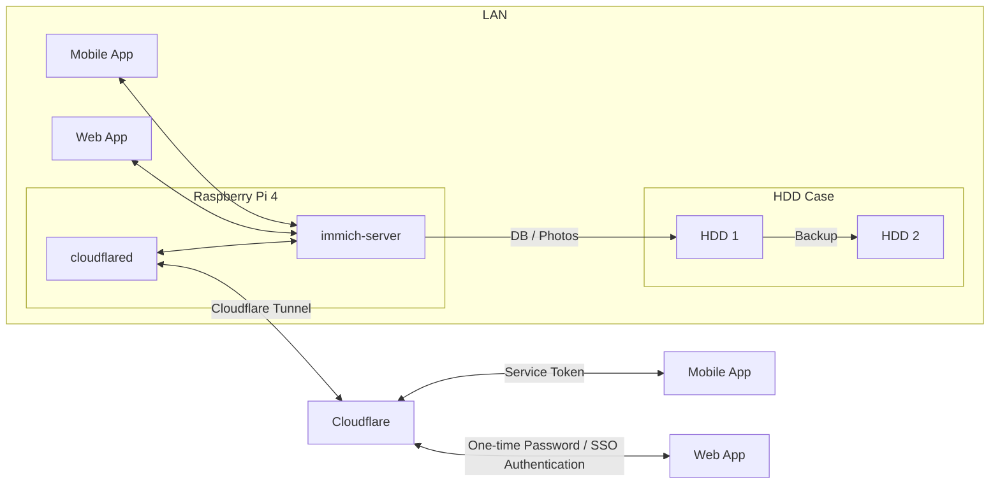
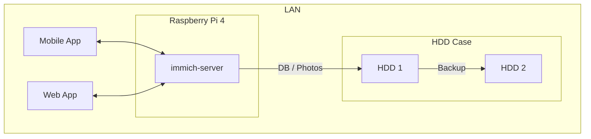
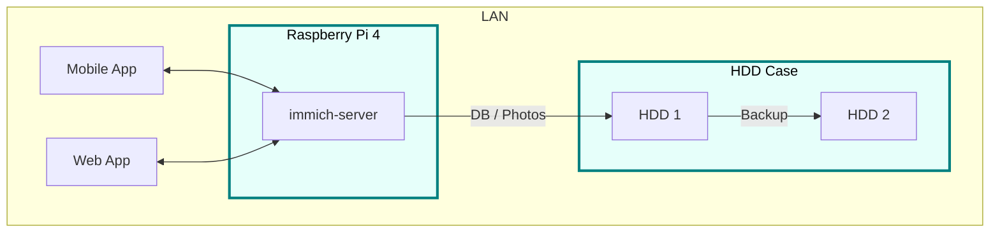
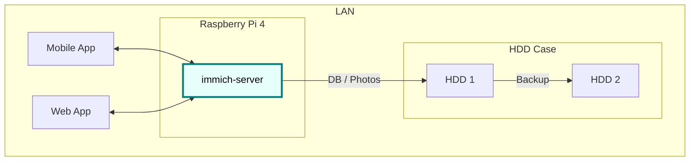
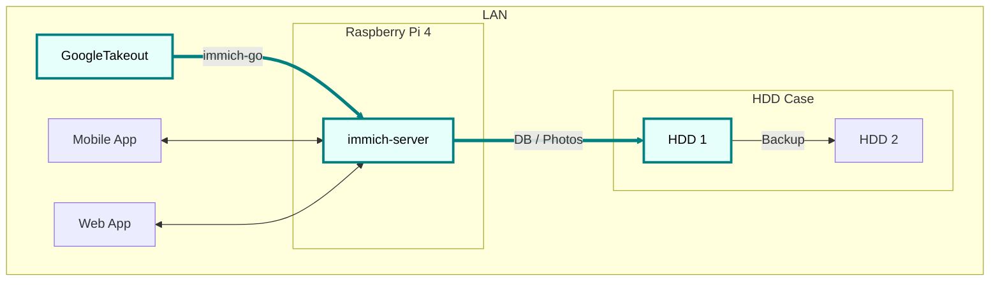
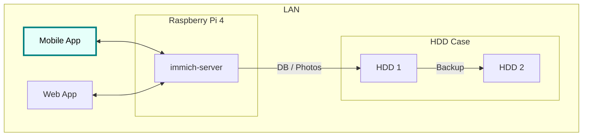
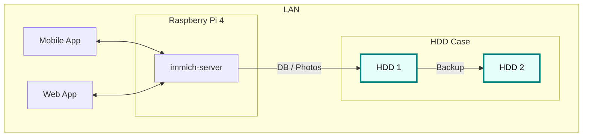
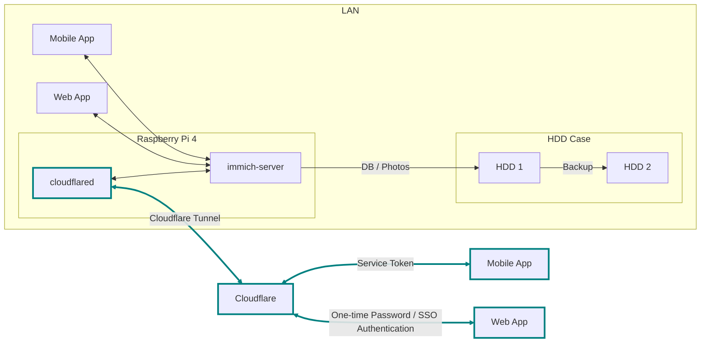
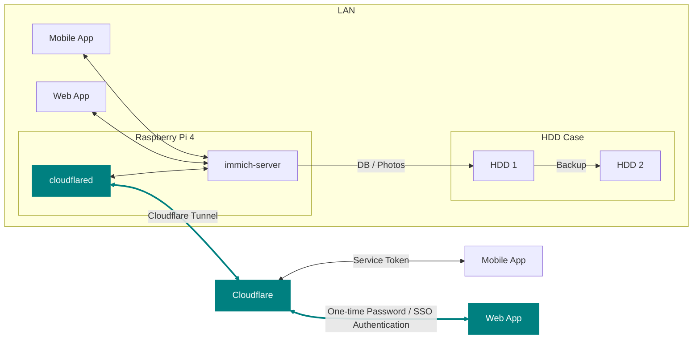
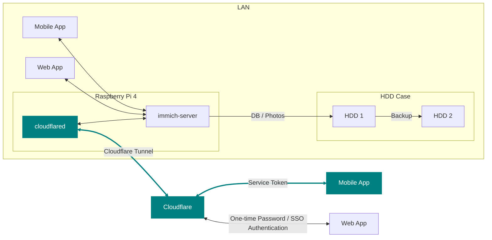

## Introduction {#introduction}


Since June 2024, I've been operating a home server for photo and video management, similar to "Google Photos at home."
It allows me to back up almost unlimited photos and videos taken with my smartphone and view them comfortably with features like timelines and albums.


I share a grandchild-exclusive album with my parents who live far away.

It has been operating stably for about a year since its launch, so I'd like to review the construction process and any challenges I encountered.

## Motivation {#motivation}

My first child was born in the first half of 2024, and the number of photos and videos rapidly increased.
Until then, I had been using Google Photos' free plan, but with the end of unlimited storage, it was limited to about 16GB, which was definitely reaching its limit.

_**In this article, "photos" refers to "photos and videos."**_

Every time I take a picture of my son, I worry about storage space... I want to take long videos without worrying... The storage problem was an issue that needed to be resolved.

The achievement conditions for this challenge are the following five:

1.  Effectively unlimited storage for photos and videos.
2.  Ability to save and view from a smartphone.
3.  No subscriptions.
4.  Ability to transfer a large amount of content saved in Google Photos.
5.  Easy sharing of my son's photos with my parents who live far away.
    -   I want to avoid the hassle of sending them via LINE every time, and instead have a state where they can just "tap here in this app to see their grandchild's photos!"

"No subscriptions" is because I would have to pay continuously unless I delete photos. My current (August 2025) photo and video data totals 265.6GB.

If I were to manage this amount with a subscription...

-   [iCloud](https://www.apple.com/jp/icloud/) 2TB ¥1,500/month
-   [Google](https://one.google.com/about/plans?hl=ja&g1_landing_page=0) 2TB ¥1,450/month
-   [Amazon Photos](https://www.amazon.co.jp/b?ie=UTF8&node=5262648051) rejected because videos are limited to 5GB.
-   [Mitene](https://mitene.us/) rejected because video length is limited to 2 minutes.

Even with Google, it costs ¥17,400 per year, and living with the thought of that continuing indefinitely is stressful.
Personally, I feel it's better for my mental health to buy an HDD and manage it myself.

In this article, I will explain:

1.  Building an unlimited photo storage (1.2.3.4.)
2.  Sharing photos with family in remote locations (5.)

## Final Diagram {#final-diagram}




The diagram above shows the flow of the Immich server within the LAN being exposed externally via Cloudflare. Mobile apps access it via tokens, and web apps access it via SSO authentication.

<!--list-separator-->

-  Characters

    1.  Immich: Open-source photo and video management application
    2.  Raspberry Pi: Server hosting Immich
    3.  HDD/Case: Storage for DB and photos
    4.  Cloudflare: Domain for external communication, tunneling

## Goal 1: Building an Unlimited Photo Storage {#goal1-building-unlimited-photo-storage}

To enable photo storage and viewing within the home, I will build the following environment:



### What You Need {#what-you-need}

You need a photo management application, a server to host it, and storage space.

#### Application {#application}

There are many open-source photo applications, but since my family only takes photos with smartphones, the existence of a mobile app is crucial.

Looking at the comparison table below, I adopted **Immich** which has a mobile app and album features.



This is a Google Photos-like photo and video management app. It also supports data migration from Google Photos (described later) by using another tool.

#### Server {#server}

I chose Raspberry Pi 4 as the server.

Although it's not the main purpose, I wanted to put it in a clear case and have a rugged look with the board visible.
I used to like the [skeleton models](https://www.nintendo.co.jp/n01/n64/hardware/clear.html) of Game Boy and NINTENDO64...

Raspberry Pi is small and easy to handle, and clear cases are readily available, making it an easy choice.


{{< linkcard url="https://amzn.to/46Zbo8y" image="https://m.media-amazon.com/images/I/71bdQexTguL._SS568_.jpg" title="Amazon | KIOXIA (formerly Toshiba Memory) microSD 64GB UHS-I Class10 (Max Read Speed 100MB/s) Nintendo Switch Verified Operation Domestic Support Genuine Product 5-Year Manufacturer Warranty KLMEA064G | KIOXIA | microSD Cards Online" description="KIOXIA (formerly Toshiba Memory) microSD 64GB UHS-I Class10 (Max Read Speed 100MB/s) Nintendo Switch Verified Operation Domestic Support Genuine Product 5-Year Manufacturer Warranty KLMEA064G is available at any time at the microSD card store. Products eligible for same-day expedited shipping can be delivered on the same day. Amazon delivery products are usually free shipping (excluding some)." >}}
Required for OS installation.

{{< linkcard url="https://amzn.to/4mJ9zBl" image="https://m.media-amazon.com/images/I/513LEFJLOML._AC_.jpg" title="Amazon.co.jp: Miuzei Latest Raspberry Pi 4 Case Raspberry Pi 4 5.1V 3A USB-C Power Adapter + Cooling Fan + Heat Sink Compatible with Raspberry Pi 4 Model B (Raspberry Pi 4 main unit not included) PSE Acquired : PC & Peripherals" description="Amazon.co.jp: Miuzei Latest Raspberry Pi 4 Case Raspberry Pi 4 5.1V 3A USB-C Power Adapter + Cooling Fan + Heat Sink Compatible with Raspberry Pi 4 Model B (Raspberry Pi 4 main unit not included) PSE Acquired : PC & Peripherals" >}}

Note that Immich must meet the essential requirements.



#### Storage Area {#storage-area}

For capacity, I prepared two physical HDDs (one for backup).



I wanted to put a bare HDD in a Logitec stand and place the Raspberry Pi in a clear case next to it...

Now that I have all the necessary items, let's set up the Raspberry Pi.

### Raspberry Pi and HDD Setup {#raspberry-pi-and-hdd-setup}



#### OS Installation {#os-installation}

Basically, follow the official procedure. The process is to insert the SD card with the OS into the Raspberry Pi and boot it.



#### Local IP Address Fixation {#local-ip-address-fixation}

Once the Raspberry Pi starts up, fix the local IP address. This IP will be used to log in to the Raspberry Pi and access Immich from home. Since automatic assignment by DHCP can cause the IP to change, it's better to fix it.

In the router's DHCP settings screen, manually set the **MAC address of the Raspberry Pi's wired LAN** and an arbitrary IP address.


In the last row of the image, an arbitrary IP address is associated with the MAC address of the Raspberry Pi's wired LAN.
You can find the MAC address by following these steps:

1.  Open the command line on the Raspberry Pi.
2.  Type `ip a`.
    ```sh
    ip a
    ```
3.  It's written after `eth0:`'s `link/ether`.

If you use Wi-Fi, you should look for `wlan0`, but wired is recommended for speed.

Note that if the desired IP address is already set on another device, it cannot be manually assigned as is. If you absolutely want to use a specific IP address (11.14 in this example), follow these steps:

1.  Disconnect the device currently using the specific IP address from the network.
2.  Restart the router to reset the IP address assignment.
3.  Manually set it.

Home router DHCP servers often assign "from available numbers in order," so younger numbers tend to be filled first (this varies depending on the model and settings). Therefore, if you want to use a younger number, you will likely need to disconnect many devices and restart the router.

Also, searching for "Raspberry Pi fixed IP" will show various methods, such as editing `/etc/dhcpcd.conf` or configuring `NetworkManager`. However, none of them worked for my environment... Finally, I succeeded by setting it on the router side. By the way, the official Raspberry Pi also recommends this method.

<!--list-separator-->

-  Very helpful article:

    

#### Remote Control via VNC or SSH {#remote-control-via-vnc-or-ssh}

Once the Raspberry Pi is set up, it's convenient to be able to operate it remotely, rather than connecting a monitor every time.



Also, it's easier if you can use public key authentication so you don't have to enter a password every time you SSH.



#### Hard Disk Formatting and Partitioning {#hard-disk-formatting-and-partitioning}

Next, install the HDDs in the HDD case and connect the Raspberry Pi to the HDD case.



Then, mount the two HDDs as described below.


_In my case, I mounted the main drive to `/mnt/hdd1` and the backup drive to `/mnt/hdd2`._

So far, I have installed the OS on the Raspberry Pi, fixed the local IP address, and mounted the HDDs.
**Next is the introduction of Immich.**

### Immich Setup {#immich-setup}



#### Docker Setup and Configuration File Preparation {#docker-setup-and-configuration-file-preparation}

It's easiest to set it up with Docker, just like the official quick start.


For the `.env` file, the photo upload destination and DB save destination will be `hdd1`, which was mounted earlier.

```env
UPLOAD_LOCATION=/mnt/hdd1/immich/images
DB_DATA_LOCATION=/mnt/hdd1/immich/postgres
```

#### Immich Admin Account Creation {#immich-admin-account-creation}

Once the containers are successfully launched with `docker compose up -d`, you can access Immich at `http://<machine-ip-address>:2283`. After accessing, create an admin user.


As an admin user, you can also create general user accounts, so I'll go ahead and create accounts for myself and my wife.


Also, it's a good idea to check the StorageTemplate settings here.

#### StorageTemplate {#storagetemplate}


This feature allows you to configure the storage location, folder structure, and file naming conventions for photos and videos.

I have set it up so that files are saved in a format like `UPLOAD_LOCATION/library/username/2022/2022-02-03/IMAGE_56437.jpg`.

This setting will be applied to photos added after the change. For items already added before the change, you can apply the setting by clicking the `Jobs → Migrate Storage Template` button.


In my case, it took a considerable amount of time to apply the settings after moving a large number of photos from Google Photos. If you have a preference, I recommend setting it up in advance.

So far, the setup of Raspberry Pi, HDD, and Immich is complete.
Next, I will save photos and videos from Google Photos to the HDD via Immich.

### Photo Migration from Google Photos {#photo-migration-from-google-photos}



I will use `immich-go`. This is a command-line tool that can migrate photos from Google Photos to the storage area managed by Immich.

The necessary materials are:

1.  immich-go
2.  Google Takeout
    -   Exported data saved in your Google account
3.  Immich API key for each user account
    -   Key required to operate Immich from outside the application

Specifically, by executing the command:

```sh
./immich-go -server=http://<machine-ip-address>:2283 -key=<Immich API key created> upload -create-albums -google-photos <path to downloaded Google Photo Takeout>
```

you can import content downloaded from Google into an arbitrary user's content in Immich.

#### About Photo Duplication {#about-photo-duplication}

Before backing up, you need to organize "where your photos are." If all your past photos are on your smartphone, you just need to launch the Immich mobile app and back up from your smartphone.
However, in reality, "photos only on Google Photos," "photos only on your smartphone," and "photos on both" are mixed.

```ascii
// Image of photos saved on Google Photos and photos saved on smartphone partially overlapping
Timeline:      2008 ------2017-------2023----------> New

Google Photos: [===========++++++++++]
Smartphone   :           [++++++++++==========]
```

It's a waste of space if the same photos are backed up. In this policy, I decided to migrate photos from Google Photos from 2008 to 2023, and then back up directly from my smartphone thereafter.

It's difficult to strictly separate them, and duplication will occur around 2024, but Immich has a duplicate detection and deletion function, so some duplication is acceptable.


_Immich's duplicate detection and deletion function_

#### immich-go {#immich-go-1}


Now, download immich-go. Click `<> Code` > `Download ZIP`.


Place it anywhere you like on your PC.

#### Google Takeout {#google-takeout-1}

You can export Takeout from here:


Check only Google Photos and click `Next step`.


Next, click `Create export`.


After a while, you will receive an email from Google.


Open the email and click the link inside. You will find download buttons for each item, so just click them in order to download.
You should download a zip file.


If you have too many items and it's troublesome, set a larger file size for export.

_In my case, I downloaded for two accounts: mine and my wife's._

#### Immich API Key {#immich-api-key-1}

Next, issue an `API key`. This key is necessary to operate Immich user accounts from `immich-go`. It is issued for each user account.

Steps:

1.  Log in to Immich.
2.  Account settings.
3.  API keys.
4.  New API key.
5.  Enter an arbitrary name and click Create.
6.  A new key will be issued, so copy it.


After clicking Create, the API key will be displayed, so copy it.

_I created two, one for my account and one for my wife's account._

#### Migration with immich-go {#migration-with-immich-go}

Before executing the command, unzip the `Google Takeout` zip file and check its contents. This time, since the policy is to back up photos from 2024 onwards from the smartphone, zip files containing data from that period are not needed.

_Example: If Takeout is split into 14 parts, and zip files from 11/14 onwards contain 2024 data, we will not use 11-14, so move them elsewhere._

Once the necessary zip files are ready, navigate to the directory where `immich-go` was downloaded and execute the following command:

```sh
./immich-go -server=http://<machine-ip-address>:2283 -key=<Immich API key created> upload -create-albums -google-photos /takeout_directory_name/takeout-*.zip
```

You can also use the `--dry-run` option to preview the operations that will be performed.

After executing the command, wait a while, and images and videos should be imported into Immich. My account had many photos, so I executed the command and went to sleep 🛌. I remember it was finished by the next morning.

_I executed it for both my account and my wife's account._

### Mobile App Settings {#mobile-app-settings}

Next, let's download and set up the Immich mobile app.



Downloading, logging in, and backing up can all be done by following the documentation below:


When the app starts, enter `http://<machine-ip-address>:2283`.


Then, enter the email address and password of the created user to log in!


Next, set up backup for photos and videos stored locally on your smartphone.


It's also a good idea to set up automatic backup.


Now, photos taken with your smartphone can be saved to the HDD via Immich and viewed directly.



### Backing Up HDD1 {#backing-up-hdd1}

Finally, I want to save the data from HDD1 to HDD2 as well. If HDD1 fails, all assets will be lost.



For backing up from HDD1 to HDD2, I use `Borg`. It's a differential backup tool.



Immich officially supports backup methods using `borg`, so I adopted it.


Follow the official documentation. I saved the script based on the "Borg backup template" in the documentation as `immich-borg.sh` and set up a crontab to run it every Saturday at 1:00 AM.

```cron
0 1 * * 6 /immich-borg.sh
```

### Done {#done-1}

With this, I have set up an environment where I can log in to Immich from my smartphone and back up photos and videos directly to the HDD.
All the initial conditions have also been cleared.

All initial conditions are cleared:

-   [X] 1. Effectively unlimited storage for photos and videos.
    -   Because I can change to a larger HDD.
-   [X] 2. Ability to save and view from a smartphone.
-   [X] 3. No subscriptions.
-   [X] 4. Ability to transfer a large amount of content saved in Google Photos.

By backing up to another HDD once a week, data redundancy is also ensured[^fn:1].

In addition, with Immich's album feature, I can create "Son's Album" or "Travel Album" and both my wife and I can add photos. The sharing style we used to do with Google Photos and [LINE](https://en.wikipedia.org/wiki/Line_(software)) has also been realized as is.

With this,

-   [X] Goal 1: Building an Unlimited Photo Storage

is cleared.

## Goal 2: Securely Sharing Photos with Remote Family {#goal2-securely-sharing-photos-with-remote-family}

Now, the photo management between my wife and I has been resolved. However, the next challenge is **sharing with parents**.
Until now, my wife and I had been sending photos to our respective parents via [LINE](https://en.wikipedia.org/wiki/Line_(software)). This was quite troublesome 😇.
I really wanted a mechanism where they could view photos whenever they wanted, all in one place.

Fortunately, Immich allows multiple accounts to be created. It also has an album feature, and permissions can be managed per album. Therefore, I can create an account for my parents and grant them viewing access to specific albums. My parents can then open the app and tap on an album to view cute photos of their grandchild 👶.


However, since it's a self-hosted server, **secure access** from outside (remote parents) is necessary.

To solve this problem, I will use `Cloudflare Tunnel`.

### Cloudflare Tunnel × Cloudflare Access　{#cloudflare-tunnel-1}

Cloudflare Tunnel is a mechanism that allows external exposure without a public IP or port forwarding, simply by installing a lightweight tool (`cloudflared`) on the server. All communication goes through Cloudflare, so it can be handled securely.


In fact, around June 2023, there was a discussion on the Immich official Discord about "how to expose it to the internet," and a certain number of users adopted Cloudflare Tunnel.


Note that Cloudflare Tunnel has upload restrictions. Be careful when uploading files larger than 100MB (this is not an issue here as it's view-only).

Also, combining it with `Cloudflare Access` authentication makes limited public access easy.

Now, let's set it up.

### Final Diagram (Cloudflare) {#final-diagram-cloudflare}



### Obtaining a Domain with Cloudflare Registry {#obtaining-a-domain-with-cloudflare-registry}

Sign up for Cloudflare and navigate from the [dashboard](https://dash.cloudflare.com/login) to `Domain Registration > Register Domain` to acquire an arbitrary domain.

### Creating a Tunnel {#creating-a-tunnel}

Once the domain purchase is complete, create a tunnel.

Steps:

1.  `Dashboard`
2.  `Side Menu`
3.  `Zero Trust`
4.  `Network`
5.  `Tunnels`
6.  `Create a tunnel`


1.  `Select Cloudflared`
2.  `Save with an arbitrary name`
3.  `Next`


Next, select `Debian` and execute the displayed command on the server.


If the command on the server side is successful, the connector ID and connected status will be displayed, so click Next.


Enter the following and click Save:

-   Subdomain: Arbitrary name
-   Domain: Select from the dropdown list of domains purchased from Cloudflare.
-   Service: HTTP
-   URL: localhost:2283


With this, your home server can now be exposed externally via Cloudflare. You should be able to access it by entering the configured URL.

### Adding Authentication with Cloudflare Access {#adding-authentication-with-cloudflare-access}

However, leaving it as is is dangerous without access restrictions. I will set it up so that only specific individuals can access it.

#### Authentication from Web Browser {#authentication-from-web-browser}


First, set up Email authentication when accessing Immich from outside the LAN via a browser.

Navigate to the policy addition screen:

1.  `Access`
2.  `Policies`
3.  `Add a policy`


Next, set the policy:

1.  Set an arbitrary name for the policy.
2.  Select Emails in the selector.
3.  Add email addresses that will be subject to SSO authentication.
4.  Save.


It will be added as follows:


Next, set the created policy to the application.

1.  `Access`
2.  `Applications`
3.  `Add an application`


Next, select the application type:

1.  `Self-hosted`
2.  `Select`


Enter the application information:

1.  Add an arbitrary application name.
2.  Click Add Public Hostname > Input field for Public Hostname appears.
3.  Enter the same subdomain and domain as for the Tunnel.
4.  In the Access Policy field, click `Select existing policy`.


1.  Check the policy created earlier and confirm.
2.  Proceed with `Next` until the Save button appears, then save.


That's all.
If you access the configured URL again in your browser, the SSO authentication screen should appear.


If you enter the email address added to the policy here, you will receive an email. By entering the passcode in the email, you can bypass authentication. After bypassing, you will be redirected to the Immich login screen.
(In the image, Google OAuth is also enabled for authentication.)


This is all for using it from a browser. When I go back to my parents' house, I sometimes connect my PC to the TV to view grandchild photos on a large screen, so this setting is essential.

#### Authentication from Mobile App {#authentication-from-mobile-app}



Next, how to access from the Immich mobile app. Since the mobile app cannot transition to an authentication screen like a browser, you cannot log in as is. Therefore, I will utilize Cloudflare's `Service Token` and the Immich mobile app's `Custom Proxy Header Settings`.

A `Service Token` is a key for apps and programs to access restricted resources on Cloudflare.

The Immich mobile app has a `Custom Proxy Header` setting that allows you to include arbitrary values in requests when accessing the server. By setting the token here, you can bypass authentication.

#### Cloudflare Settings {#cloudflare-settings}

Now, let's create a Service Token.

1.  `Cloudflare Zero Trust Home`
2.  `Access`
3.  `Service Auth`
4.  `Create a Service Token`


1.  Enter an arbitrary token name.
2.  Enter an arbitrary expiration date.
3.  Generate token.


Then, the `Client ID` and `Client Secret` will be displayed as follows, so copy them.


Next, create a policy again.

Next, create a policy again. Select Service Token from the selector and choose the token created earlier from the dropdown.


Save the policy and set this policy to the application created earlier.

1.  `Access`
2.  `Applications`
3.  Three dots of the created application name.
4.  `Edit`


Add the policy to the application:

1.  `Tag: Policy`
2.  `Select existing policy`
3.  Select the created Service Token policy.
4.  `Confirm`
5.  `Save application`


This completes the Cloudflare settings.

#### Immich Mobile App Settings {#immich-mobile-app-settings}

Next, in the Immich mobile app, set it to include the token when accessing.

1.  Open the Immich mobile app login screen.
2.  Tap the gear icon.
3.  Tap Custom Proxy Headers.
4.  Enter the following in the proxy headers:
    1.  Header and value of the generated Client ID.
    2.  Header and value of the Client Secret.


That's all for the settings 👍️.
Now, even if you access the external URL from the Immich mobile app, you can pass authentication and view photos by logging in with your created account.


In other words, you just need to perform the following steps for four people:

1.  Create accounts for both parents in Immich.
2.  Grant viewing permissions to the son's album for both parents' accounts.
3.  Download the mobile app to both parents' smartphones.
4.  Set up custom proxy headers in the mobile app.
5.  Log in with each account.

Now, my parents can log in with their own accounts and tap on an album to view photos of their grandchild anytime.

### Done👍️ {#done-2}

With this,

-   [X] Securely sharing photos with remote family

is cleared.

## Conclusion {#conclusion}

With this setup, I was able to meet all the following conditions:

1.  Effectively unlimited storage for photos and videos.
2.  Ability to save and view from a smartphone.
3.  No subscriptions.
4.  Ability to transfer a large amount of content saved in Google Photos.
5.  Easy sharing of my son's photos with my parents who live far away.

Let's review the costs and pros/cons.

#### Costs {#costs}

| Item                 | Unit Price | Quantity | Subtotal |
|--------------------|------------|----------|----------|
| Raspberry Pi 4 (8GB) | ¥12,000    | 1        | ¥12,000  |
| HDD 1TB              | ¥7,000     | 2        | ¥14,000  |
| HDD Case (Stand)     | ¥4,000     | 1        | ¥4,000   |
| Miscellaneous (SD, Cable) | ¥600       | 1        | ¥600     |
| Total                |            |          | ¥30,600  |

| Item  | Unit Price | Quantity | Subtotal |
|-----|------------|----------|----------|
| Domain | ¥1,000     | 1        | ¥1,000   |
| Annual Total |            |          | ¥1,000   |

Google One (2TB) is ¥17,400/year.
Although there are initial costs, it's a good deal if operated for less than 2 years...?!

#### Pros and Cons {#pros-and-cons}

Pros:

-   No subscription fees (capacity is virtually unlimited if HDDs are added).
-   Good for learning as an engineer.

Cons:

-   Initial setup effort (requires understanding Docker, Cloudflare, etc.).
-   High risk if HDD breaks. Difficult to diversify risk compared to cloud.
-   Immich updates sometimes have breaking changes, requiring careful research and handling.

Hmm... not many pros...? 🧐

It's great for engineers to learn and as a hobby, but if you just want to save a lot of photos and videos, subscribing is faster.

#### Future Challenges {#future-challenges}

-   I want to set up another backup location.
-   HDD2 is constantly connected and spinning, despite being for weekly backups.
    -   Can it be set to only run when needed and sleep otherwise?
-   Immich freezes for about a minute when opened on iPhone.
    -   This is likely because there are too many photos locally on the phone, and it takes time to check if they have been backed up.
    -   I want to investigate this if I have time.

[^fn:1]: According to the [3-2-1 backup strategy](https://www.backblaze.com/blog/the-3-2-1-backup-strategy/), another backup should be prepared in a different location.
